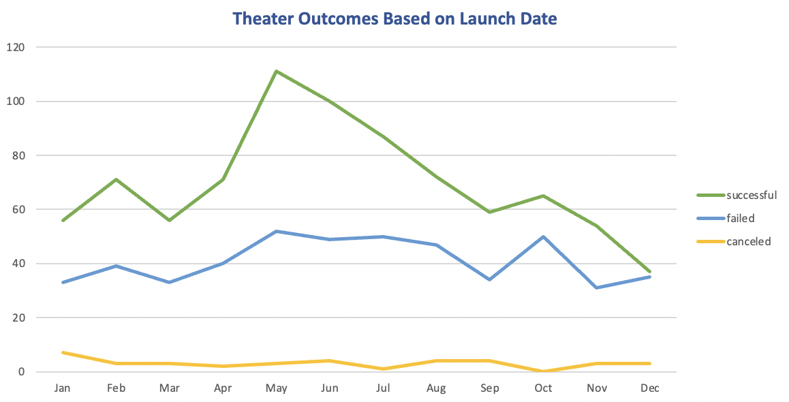
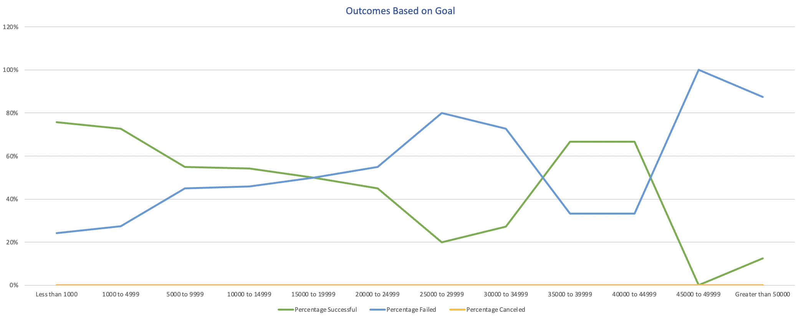

# Kickstarting with Excel

## <u>Overview of Project</u>

This analysis will help gain understanding of a campaign from start to finish.

### Purpose
The purpose of this project is to organize, sort, analyze raw data to determine which factors make a crowdfunding campaign successful.  Therefore, generating insights which are going to help Louise make better decisions for her project.

## <u>Analysis and Challenges</u>

### Analysis of Outcomes Based on Launch Date

### Analysis of Outcomes Based on Goals

### Challenges and Difficulties Encountered
The initial data on launch date and deadline columns, had UNIX timestamps. In order to make the data readable and easy to use, it had to be converted to standard date format.

## <u>Results</u>

1. What are two conclusions you can draw about the Outcomes based on Launch Date?

    -  Data shows that during May-June theater campaigns were more successful.

    -  Campaigns that were launched during December were not as successfull since the number of failed campaigns is very close the number of successful.

2. What can you conclude about the Outcomes based on Goals?
    - Campaigns with highest success rate, had a goal of $5,000 or less. 
    - Theather campaign over $25,000 have a high percentage of failure. 

3. What are some limitations of this dataset?
    - The most recent year the data uses is 2017, this could be a limitation in providing accurate information, so data from more recenet years should be used. 
    
    - There are several campaigns which show that are still "live". However, since the data is not recent some of those might have a different outcome. 

4. What are some other possible tables and/or graphs that we could create?
    - In order to see further differences between countries, graphs could be filtered by country.
    - Adding the length of campaigns to our charts could be useful to visualize and understand what the appropriate length of a campaing should be.

## <u>Resources:</u>

Documentation used for formatting: [Basic writing and formatting syntax](https://docs.github.com/en/github/writing-on-github/getting-started-with-writing-and-formatting-on-github/basic-writing-and-formatting-syntax)

Documentation used for understanding: [Unix timestamps](https://websiteseochecker.com/blog/what-is-timestamp/)